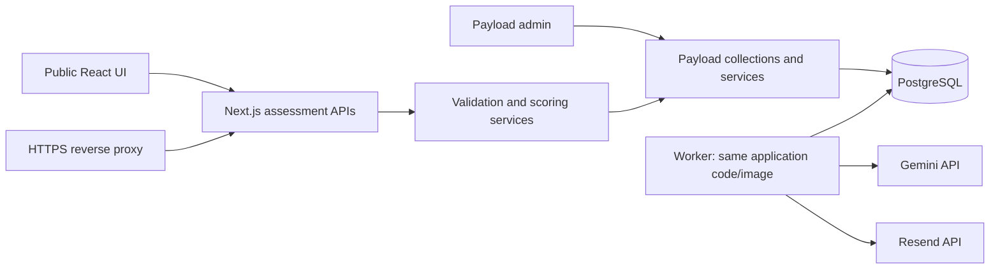

# Step 4: Backend design and implementation plan

Status: technical proposal for review, not an implemented backend. Existing product agreements remain authoritative; defaults marked **proposed** are recommendations rather than previously approved decisions. Keep this document current during implementation, then move it to `docs/specs/done/` after verification, as required by `general.md`.

## 1. Objective and scope

Replace the prototype's simulated services with a persistent, CMS-driven assessment service while the owner independently refines the landing page and questionnaire UI. Use stable contracts so layout and copy changes do not require backend redesign.

Preserve the agreed experience:

- One Next.js application with React Hook Form, Payload admin, PostgreSQL, Gemini, and Resend. VPS deployment in Docker; no separate Vite or Python application.
- CMS-editable landing page and questionnaires using basic fields. Custom visual builders and Figma-led redesign are deferred.
- One question at a time; same core questions for everyone; review/edit before submission; database autosave and same-browser resume; no account or email gate.
- One optional AI clarification after core questions. Scores affect results without human review. All relevant unscored answers may inform evaluation and recommendations.
- Up to two priority categories, selected below configured thresholds using business impact/context. Allow no major issues; do not fabricate weakness.
- Retry AI failures, expose deterministic results if needed, and optionally email a private expiring report link through Resend.
- Contact CTA: required email, optional name/message. Leads progress through New → Contacted → In progress → Closed in admin. Notification-only email does not create a lead.
- Stable random UUID questionnaire URLs; new submissions use latest publication; existing submissions keep their original version. Published definitions are immutable. No disabling/blocking content workflow and no production test/real submission mode.
- All forms, including draft previews and live forms, and private reports are noindex. Landing page is indexable. Private data needs authorization regardless of indexing.

Reference documents: [V1 scope](V1_SCOPE.md), [prototype handoff](STEP_3_PROTOTYPE_HANDOFF.md), [scoring reference](../SCORING_REFERENCE.md), [initial AI rubric](AI_RUBRIC_INITIAL.md). This document designs the backend; it does not replace the detailed questionnaire copy in those files.

## 2. Repository findings and migration boundary

The repository already contains a Next.js prototype, React Hook Form, Zod, Vitest, and Playwright. `package.json` requests Next.js `^16.3.4` and React `^19.3.0`; the lockfile is authoritative for installed versions. npm is the project package manager. Read `general.md`, `typescript-react-guidelines.md`, applicable AGENTS.md, and installed Next.js guides before implementation.

Relevant boundaries:

- `lib/mock-services.ts`: landing/questionnaire reads, browser-local progress, analysis, notification, and contact mocks.
- `lib/types.ts`: useful starting domain types, but too narrow for asynchronous backend processing, validation configuration, and grouped scoring.
- `lib/scoring.ts`: hard-coded denominator 16.5, count divisor 10, quality weights/curve, head option ID, and coverage 0.6. These must become configuration; existing calculations provide regression examples.
- `lib/fixtures.ts`: initial content to transform into an idempotent development/initial-publication seed.
- `lib/scoringDebug.ts` and scenario controls: development aids; remove or exclude production exposure of scoring internals and fixture results.
- Existing components and CSS are actively changing. Avoid unrelated UI edits. Introduce contracts/adapters first, then coordinate the minimal integration changes.

The existing `PrototypeServices` is not a drop-in production contract: progress loading is synchronous and analysis takes a scenario flag. Replace these assumptions with async reads, submission identity, job status, and validated HTTP responses. Never transmit `scenario` or artificial failure flags as production API controls.

## 3. Architecture



One application/codebase, with separate web and worker processes deployed from the same versioned image. PostgreSQL stores application data and durable job state. No Redis or separate Python service initially.

Use Payload's PostgreSQL adapter and Jobs Queue. A continuously running worker executes supported job APIs; do not depend on browser polling, request-lifetime promises, or an exposed unauthenticated job-run endpoint. Prove worker build/start/restart behavior against the selected Payload version before committing to deployment wiring. Payload supports queued tasks and job execution through its APIs. [Payload Jobs Queue](https://payloadcms.com/docs/jobs-queue/overview)

Use a small application outbox when submitting work: save the submission transition and work request in the same database transaction. A dispatcher delivers outbox entries to Payload jobs. Duplicate delivery is acceptable because handlers have durable application-level idempotency. This avoids losing analysis when the web process crashes between saving a submission and enqueueing work. Confirm transaction propagation through the adapter with integration tests. [Payload transactions](https://payloadcms.com/docs/database/transactions)

### Compatibility gate

Payload's current installation documentation lists Next.js 16.2.6+ among supported ranges and installs within the App Router using `withPayload`. This suggests the current Next.js family is suitable, but is not a substitute for checking exact React/Next/Payload package peer dependencies and a working admin build. Pin a compatible set of Payload packages together; retain npm and the lockfile. Do not blindly install latest packages over the prototype. [Payload installation](https://payloadcms.com/docs/getting-started/installation)

Read local Next.js guides for route handlers, cookies, cache invalidation, and route-group layouts. Keep public routes and Payload routes in separate route groups/layouts without changing public URLs. Use `/api/assessment/v1/...` for application APIs and leave Payload's reserved endpoints separate.

## 4. Proposed defaults to review

These defaults make the plan concrete. Retention and expiry are product/operational proposals, not legal advice or authorization to delete existing data. No retention purge should run before the policy is accepted.

| Decision | Proposed starting value | Notes |
| --- | --- | --- |
| Minimum category evidence coverage | 60% of applicable scoring weight | Separate from the already agreed below-60% attention threshold; configurable per category |
| Required questions in initial seed | Q1–13 and Q16 required; Q14–15 optional | CMS-editable; publish-time validation checks consistency |
| Q7 final option | 0 | “I often forget and realise later” |
| Q13 wording/rubric | Use the revised prompt and initial five-level rubric | Review on sample answers before public launch |
| Anonymous browser session | 30 days of inactivity, renewed on legitimate use | Host-only Secure HttpOnly SameSite=Lax cookie in production |
| Incomplete submissions | Retain 30 days since last activity | Warn before expiry where practical; purge policy requires acceptance |
| Completed assessments and associated leads | Review for deletion/anonymization after 12 months of inactivity | An active lead pauses automatic deletion pending admin review |
| Report link | 7 days from issuance; read-only report scope | Token stored hashed; explicit exchange avoids consuming links during email scanning |
| Report-view session after exchange | 24 hours, limited to one report | Does not grant editing or access to other submissions |
| Short AI retries | 3 attempts total per stage, retry delays around 2 and 10 seconds with jitter | Request timeout 30 seconds; respect provider Retry-After |
| Deferred AI recovery | 3 further attempts after roughly 1 minute, 5 minutes, and 30 minutes | Then a terminal admin-visible error, not endless pending |
| Browser status polling | Start around 2 seconds, back off to 10 seconds | Pause when hidden; worker proceeds independently |
| Input limits | 4,000 characters per open answer; 1,000 per accompanying text; 64 KB request body | Publish/configuration must fit validated application limits |
| Worker concurrency | 2 AI tasks initially | Configurable, bounded; deduplicate work per run/stage |
| Backups | Daily encrypted off-host backup, 14-day rotation | Proposed recovery objectives: at most 24 hours data loss, restore within 4 hours; verify actual restore time |

Keep budgets flexible as requested, but log provider usage and rate-limit expensive actions. Exact hosting/provider costs are not estimated here.

## 5. Data model and CMS editing

Standard identities, relationships, status fields, timestamps, and contact data remain relational. Strategy/rubric/validation details use schema-validated JSON or typed Payload field groups. No arbitrary code evaluation.

### Content entities

| Entity | Main fields and invariants |
| --- | --- |
| AdminUser | Payload auth collection; one admin role; no public registration |
| LandingPage global | Draft/published headline, supporting copy, audience, steps, CTA label, questionnaire relationship, page title/meta description |
| Questionnaire | Internal ID, stable unique public UUID, name, current published version reference, draft reference |
| QuestionnaireVersion | Questionnaire FK, version number, draft/published state, definition schema version, published timestamp, content hash, result/CTA settings, engine compatibility version |
| Category | Version FK, stable key, order, label, scored flag, maxPoints, attentionThreshold, minimumCoverage, result visibility |
| Question | Version/category FK, stable key/order, type, prompt, instructions, required, scoringStrategy, scoringConfig, weight, validationConfig, AI-context flags, result visibility |
| QuestionOption | Question FK, stable key/order, label, quality value, positive penalty magnitude, exclusive, requiresText, defaultOtherValue, notApplicable |
| AIEvaluation | Version/category FK, evaluation key, evaluated question references, context question references, rubric levels/examples, weight, prompt version, configured model ID/settings |

Initial CMS presentation uses basic fields, ordered relationships/arrays, selects, and validated JSON/field groups. No visual page or questionnaire builder. Provide concise help text for formulas and units. Restrict strategy choices to compatible input types and expose settings for the selected strategy.

Question weights apply to directly scored questions. A grouped rubric has its own weight; participating questions do not also contribute duplicate scores. Validate that each scored unit is counted once. Support context-only references independently of score contribution and result visibility.

### Publication protocol

1. Edit a draft definition with version-scoped children. Never point published children to mutable shared option/rubric records.
2. Validate all IDs/references, required configuration, curves, finite weights, strategy/type compatibility, max selections, rubric levels, and result settings.
3. In one transaction, lock/check the draft revision and questionnaire publication pointer; create an immutable published version with copied relational children and a canonical validated definition snapshot/hash.
4. Move the questionnaire's current-publication pointer to the new version only after all rows/snapshot are complete. Concurrent publish attempts must not reuse a version number.
5. Create the next editable draft by copying the publication when required. Preserve stable question keys across versions, but use version-scoped database IDs.
6. Invalidate cached public landing/questionnaire projections after commit. A durable outbox can retry invalidation; a short public cache lifetime limits stale pointer exposure if invalidation fails.

Canonical published snapshot is the scoring input. Relational children are its immutable browseable representation and references for answers. Derive both in the same publish operation; reject normal update/delete for published definitions. A content hash detects drift but does not replace write protection. Privacy purges may remove submission data without deleting published definitions.

Public `GET` returns only a safe display projection: question labels/types/validation and publication identity, not private rubrics, model prompts, contact records, or scoring-debug data. Published definitions may be cached by version/hash; latest-publication lookup is refreshed on publish. Resume reads the submission's exact version. Beginning a new submission with a stale displayed version returns a refresh-required conflict rather than silently attaching different questions.

### Submission and scoring entities

| Entity | Main fields and invariants |
| --- | --- |
| AnonymousSession | Token hash, timestamps, expiry; no email required |
| Submission | Session FK, exact published version FK, state, revision, current step, timestamps, submitted answer snapshot/hash, current report run reference |
| Answer | Submission/question FK, explicit answered/skipped state, text, revision; unique submission + question |
| AnswerSelection | Answer/option FK, accompanying text; unique answer + option; option must belong to the question/version |
| Clarification | Submission/evaluation FK, prompt, response, status and timestamps; one respondent clarification round per initial submission |
| ScoringRun | Submission/version FK, answer snapshot/hash, run number, reason, engine/rubric/model/prompt versions, state, timings; append new run on recalculation |
| QuestionScore | Run/scoring-unit key, optional question or grouped evaluation FK, score nullable, status, weight, evidence references; group contributes once |
| CategoryScore | Run/category FK, normalized score nullable, points nullable, expected/usable weight, coverage, status, eligibility |
| AIAnalysis | Run/stage/evaluation reference, structured validated output, evidence, provider/model identity, usage, timing, sanitized failure metadata |
| Report | Run FK, status, selected category IDs, summary/first steps, evidence references, generated time; immutable finalized output |
| Lead | Unique submission FK, email, optional name/message, stage, internal notes, timestamps |
| NotificationRequest | Submission FK, email, explicit purpose report-ready, consent/request time, delivery state |
| AccessGrant | Hash of high-entropy token, exact report FK, purpose, expiry, revocation/used state |
| Outbox / TaskAttempt | Durable work request, unique logical task key, status, availableAt, attempt/lease metadata |
| EmailDelivery | Logical delivery key, recipient/payload hash, provider ID, status, retry state; prevents duplicate notification work |

Do not assume declared collection fields automatically provide all required constraints. Add migration-level indexes/unique constraints and transactional checks where necessary. Runtime answer cross-version validation is mandatory even if database composite constraints also exist.

Autosave updates the latest answer record; the submission-time snapshot freezes the evaluated content. This persists every current answer and retains evaluated history without storing every keystroke indefinitely. Scoring runs retain their inputs even if later recalculation is requested. Main answers become read-only after submit in V1; the permitted clarification is appended separately. Admin edits notes/stage, not historical answers.

## 6. Access and private browser state

- Issue an unpredictable anonymous session token in a host-only HttpOnly cookie; store only its hash. Resolve submissions by both ID and owning session on every private request.
- Same-browser resume queries owned submissions for the public questionnaire. A cookie authorizes access; the public UUID never does.
- Admin auth remains Payload-owned. Bootstrap the initial admin through a controlled one-time command before public exposure; no open first-user creation window.
- Explicitly deny public generic CRUD access to submissions, answers, scores, leads, notifications, grants, and jobs. Anonymous application routes call narrowly scoped domain services after ownership validation.
- Payload Local API can bypass access controls. Use `overrideAccess: false` with the correct admin identity for ordinary admin requests; keep any trusted service override isolated and reviewed, never driven by caller-supplied filters. [Payload Local API](https://payloadcms.com/docs/local-api/overview)
- Validate Origin/CSRF protections for cookie-authenticated writes, request bodies, resource ownership, and state transitions. Do not introduce broad production CORS to solve development networking.
- Private responses use `Cache-Control: no-store`; report pages use noindex and `Referrer-Policy: no-referrer`. Ensure public caches never include cookies or personalized content.
- Use rate limits at reverse proxy and application boundaries. Count submission creation, submit/AI triggers, notification requests, login attempts, and token exchanges. Do not trust arbitrary forwarded IP headers.
- Separate anonymous editing credentials from report-only access. A report grant cannot modify answers or submit contact as the original owner without an explicitly designed permission.

### Report links

Generate a high-entropy token; email a URL such as `/report/access#token=...`. The fragment avoids routine proxy URL logging. The page removes it from visible history and exchanges it via POST only after an explicit “Open report” action, reducing scanner consumption. Exchange consumes a valid grant once and issues a short report-scoped cookie; redirect to a clean report route. Never store raw tokens in logs or browser persistent storage.

An expired/used link does not expose whether an arbitrary report exists. Original browser ownership can still allow viewing retained results. Resending a link is restricted to the owning session or admin and rate-limited; no public email-to-report lookup. A lost link and lost original session requires admin support in V1, not a new customer-account system.

## 7. API contracts

Use Next.js Route Handlers with Zod request/response schemas and a versioned application namespace. Use JSON transport, explicit error codes, and a request ID. Render/API callers share domain contracts, not direct Payload collection shapes. Database IDs and scoring details are not accepted as authoritative client claims.

| Method and path under `/api/assessment/v1` | Contract |
| --- | --- |
| GET `/landing` | Published public landing projection and linked questionnaire UUID |
| GET `/questionnaires/:uuid` | Latest display definition, version ID/hash, categories/questions and validation |
| POST `/sessions` | Idempotently establish/refresh anonymous cookie; response contains no raw session secret |
| GET `/questionnaires/:uuid/resume` | Current session's active/latest submission summary or null; no-store |
| POST `/submissions` | `{ questionnaireUuid, displayedVersionId }`; returns submission ID, actual version, revision, initial state; conflict if publication changed |
| GET `/submissions/:id` | Owned version projection, saved answers, current step, revision, processing/clarification status |
| PUT `/submissions/:id/answers/:questionKey` | Explicit answered/skipped value, selections/text, expected submission revision and client mutation ID; validates and atomically updates answer + revision |
| PATCH `/submissions/:id/progress` | Current step and expected revision; step is a navigation hint, never proof of completion |
| POST `/submissions/:id/submit` | Expected revision and Idempotency-Key; validates all required answers, freezes input and queues work; 202 + run/status |
| GET `/submissions/:id/status` | Submission state, run ID, pending stages, clarification if present, terminal error/retry status; no fabricated percentage |
| POST `/submissions/:id/clarification` | Clarification ID, response or explicit unable-to-provide response, revision/idempotency key; one round only; queues continuation |
| GET `/submissions/:id/report` | Complete/partial/insufficient/pending/error projection with scored priorities or deterministic fallback; authorizes owner or exact report grant |
| POST `/submissions/:id/notification` | Valid email and purpose; upserts one pending request, returns neutral accepted response; no lead |
| POST `/submissions/:id/contact` | Email/name/message + idempotency key; creates one linked New lead, returns confirmation |
| POST `/report-access/exchange` | Token; establishes report-only cookie and returns clean destination |
| POST `/submissions/:id/report-link` | Owning session only; sends/reissues link to already registered notification address under a rate limit |

Admin operations: publish, clone draft, inspect runs, retry failed processing, and recalculate. Use protected Payload actions/endpoints invoking the same services; do not expose these on anonymous routes. Recalculate uses the original definition by default and records the requested model/engine version. An alternative rubric evaluation must snapshot an explicit override and never masquerade as the original scoring configuration.

Error shape: `{ error: { code, message, fieldErrors?, requestId }, revision? }`. Use 400 malformed, 401 missing credential, 404 inaccessible/not found without leaking existence, 409 stale revision/invalid state/idempotency mismatch, 422 invalid answer, 429 throttled with Retry-After, and 503 temporary service failure.

Serialize answer writes in the frontend adapter and retain the same mutation ID across a retry. Deduplicate by session/submission + mutation ID and payload hash. A stale tab receives 409 and a recoverable reload/reconcile response, never silent last-write-wins over newer answers. Final submit waits for acknowledged saves. Successful mutation response returns the new revision.

Proposed report union distinguishes `pending`, `partial`, `complete`, `insufficient`, and `failed`. Include `analysisComplete`, category status, and available deterministic evidence separately from priority selection. Do not encode “all healthy” as an empty list alone.

## 8. Scoring engine and CMS configuration

Keep pure shared primitives; the backend is authoritative. Client-side preview may reuse them but submitted numeric scores are ignored. Use a Zod discriminated union keyed by strategy; reject nonfinite values, invalid references, unsupported reducers, zero total weight, and malformed curves before publish.

| Strategy | Configuration |
| --- | --- |
| none | No scoring contribution; context inclusion independent |
| single_choice_value | Option values in 0–1; explicit not-applicable flag |
| multi_select_count | Explicit count curve/buckets and zero/exclusive semantics |
| multi_select_weighted | Explicit mode, positive penalty magnitudes and denominator for penalties; bounded configured reducer/normalization for value mode |
| multi_select_quality_quantity | Quality reducer, quality/quantity weights, quantity curve, declarative singleton option override |
| ai_rubric | Evaluation questions, context references, five level descriptions/examples, weight, model/prompt versions |

Seed the agreed values: Q5 quality/quantity 60/40, curve 1→1, 2→0.8, 3→0.55, 4→0.3, 5+→0, head-alone override zero; Q8 denominator 16.5 including Other; Q9 linear 1-count/10 with exclusive None and text-required Other. Q10 no recurring tasks is not applicable. Defaults: weight 1 and category maximum 20. Compare normalized unrounded scores against strict `<0.6` attention threshold.

Calculate weighted averages from usable scores only. Coverage denominator excludes explicit not-applicable scoring units; unknown/skipped units remain missing evidence. Zero applicable weight yields not-applicable/no numeric score, not perfect health. Below minimum coverage yields insufficient/no numeric category score. Preserve raw usable components for admin diagnosis.

Q11–13 produce one grouped score. A valid AI result is exactly one of 0, 0.25, 0.5, 0.75, 1; insufficient evidence produces null. Model confidence is diagnostic metadata, not a multiplier or calibrated probability. Category evaluation and question-level evaluation must not double-count the same unit.

Result visibility and context participation are separate configuration. Hidden scored questions may still contribute to the configured aggregate, but their answer details must not leak into customer explanations if excluded from display; validate allowed evidence projection accordingly.

## 9. Processing states, jobs, and retries

```text
Submission:
in_progress → submitted → processing → awaiting_clarification → processing
                                  ↘ ready / partial / failed

Scoring run:
queued → deterministic_done → ai_pending → waiting_for_input → ai_pending
                                      ↘ complete / partial / failed
```

Store exact machine transitions and separate provider failure from insufficient respondent evidence. A complete run can contain an insufficient category; a partial run has unfinished/failed provider stages. Track per-stage outputs so retries never repeat successful stages unnecessarily.

1. Submit transaction freezes answers, creates a run and outbox work request, and returns quickly.
2. Deterministic job validates stored input and writes question/category results with unique `(run, scoringUnit)` keys.
3. AI evaluation job builds context from that run's exact definition and answers. On first insufficiency, persist one clarification request and pause without retrying the same vague answer.
4. Clarification response creates a new immutable input revision/continuation snapshot while retaining the pre-clarification evaluation, then enqueues evaluation once more. If still insufficient, finalize that evaluation with null score. Recalculations must not open another customer clarification loop.
5. Aggregate coverage and eligibility. Narrative job receives eligible category IDs/scores and relevant context; it selects at most two and supplies a grounded summary and first steps. Backend rejects unknown/ineligible IDs or duplicate priorities.
6. Finalize report atomically, then enqueue a report-ready email only if requested. A superseded run must not overwrite a newer chosen report pointer.

Each logical stage has a unique key and a lease/claim or equivalent proven queue protection. DB writes use conditional state transitions. At-least-once task execution is assumed. Do not hold database transactions while awaiting external APIs. Recover interrupted leases after restart; verify Payload's selected-version behavior in a fault-injection test and add application reconciliation where needed.

Retry transport errors, 429 and appropriate 5xx with bounded backoff; respect provider Retry-After and avoid nested SDK/queue retry multiplication. Invalid structured output gets a bounded retry with validation feedback. Invalid credentials/configuration is a terminal operational error, not something to retry indefinitely. Record timeout ambiguity: provider work may have completed despite a lost response, so repeated AI calls can incur extra cost.

After short retries, expose deterministic fallback with pending AI status. Deferred recovery continues independently of notification signup. After all recovery attempts fail, show analysis unavailable/partial and expose an admin retry action; do not leave a spinner forever.

**Proposed clarification-recovery rule:** if AI recovers later but needs clarification, persist the question for the original browser's next visit. Do not email “report ready” or grant cross-device answer editing. If there is no response after 24 hours, finalize with that evaluation insufficient and generate a clearly limited report from usable evidence; then notify if requested. This resolves the outstanding promise without expanding general cross-device resume, but needs product review.

**Proposed narrative-failure fallback:** expose deterministic scores with neutral CMS-authored score-band text, label personalized analysis unavailable, and avoid presenting a deterministic ordering as completed AI prioritization. For no eligible categories with completed evidence, a neutral no-major-issues result needs no extra model call. Incomplete evidence must be disclosed.

## 10. Gemini integration

Use a server-only provider adapter and the official Google GenAI SDK with structured output, plus independent Zod validation. Gemini supports a subset of JSON Schema; test the exact generated schema, do not assume all Zod refinements translate into provider constraints. [Gemini structured output](https://ai.google.dev/gemini-api/docs/structured-output)

Proposed model policy: start with a currently supported stable Flash-class text model that passes the rubric/schema fixture checks. Resolve the exact model identifier and pin SDK/model configuration during the compatibility spike; do not silently choose an unverified preview model or promise historical reruns will be bit-identical. Store the requested model ID, provider-returned model identity where available, prompt hash/version, rubric snapshot, engine version, and usage per attempt.

Evaluation output: level/score or null, confidence, themes, explanation, insufficientInformation, evidence references, and optional follow-up question. Narrative output: overall summary and up to two `{ categoryId, explanation, firstStep, evidence }` objects. Backend determines scores/eligibility; narrative generation cannot change them.

Treat answers as untrusted quoted data, not model instructions. Supply only the current submission's needed content; omit email/contact metadata and other submissions. Include permitted unscored context with clear separation from scored evidence. Validate exact evidence IDs/excerpts against submitted answers and bound output length. Do not claim observed financial losses or other facts absent from answers. Reuse successful evaluations across narrative retries within a run. No public scoring API that accepts arbitrary external prompts.

Author rubric and example content in CMS using the initial document. Validate against short/long clear answers, vague answers, effective manual work, stress handled well, contradictory evidence, and prompt-injection attempts. This is calibration work, not a claim of scientific validation.

## 11. Resend delivery

Use an application email-delivery record keyed by purpose + submission/report version + notification request. Render one stable payload per logical send, use a stable Resend idempotency key, and retain the provider response ID. Resend's idempotency retention is 24 hours, so provider deduplication alone does not cover arbitrary long-delayed retries. [Resend idempotency keys](https://resend.com/docs/dashboard/emails/idempotency-keys)

If a crash occurs after send but before saving the response, retry the same payload/key within that window. If delivery remains ambiguous beyond it, mark unknown for reconciliation instead of blindly resending. Do not promise exactly-once email under all network failures. Verify signed webhooks if used for bounce/delivery status; do not equate API acceptance with inbox delivery.

Generate a report token when preparing a stable email delivery, not on every retry. Keep raw token material only as long as needed in tightly restricted delivery payload storage; redact from logs and purge it after delivery/expiry. The access-grant lookup stores only a hash. Use a verified sending domain and server-only credentials. Contact CTA capture does not require sending an email to the owner in V1; admin notification was not explicitly agreed.

## 12. Deployment, caching, and operations

Docker Compose services: `web`, `worker` (same image/release), `postgres`, and the existing or chosen HTTPS reverse proxy. Expose only the proxy publicly; PostgreSQL and worker stay on a private container network. Persistent database volume; pinned images; runtime secrets supplied outside source control.

Proposed environment schema: DATABASE_URL, PAYLOAD_SECRET, APP_ORIGIN, GEMINI_API_KEY, GEMINI_MODEL, RESEND_API_KEY, EMAIL_FROM, SESSION_TOKEN_PEPPER, REPORT_TOKEN_PEPPER, worker concurrency and retry settings. Validate at startup. Separate public metadata from secrets. Keep production anonymous sessions secure; local HTTP development may use explicitly development-only cookie settings.

Serve landing content and public questionnaire shells with explicit caching and publish invalidation; private APIs/results are never shared-cached. New UUID questionnaire content must become usable without a rebuild. Do not use a full static export for the integrated Payload/API application. Self-hosted cache behavior and generated route availability need an integration check with the installed Next version.

Run migrations as a controlled one-shot deployment step, not concurrently in every container. No development schema-push in production. Back up before destructive migrations; rehearse rollback, noting application rollback cannot automatically undo schema/data migrations. Seed safely without resetting existing records or changing published versions.

Add liveness/readiness checks and worker heartbeat. Log request/run/job IDs, stages, latency, sanitized errors, retry counts, and provider token usage; never raw answers, email addresses, credentials, or report tokens. Observe starts, completions, drop-offs, report delivery, CTA conversion, and AI cost without copying sensitive answer text into analytics.

Prove backup restoration into an isolated database; a backup file alone is not recovery evidence. Retention jobs must remove linked private records and expired secrets consistently, respect active-lead review, and account for backup expiry. Existing no-blocking product decision does not prohibit infrastructure abuse limits or emergency operator maintenance.

## 13. Bounded implementation tasks

Follow repository instructions for feature work: branch/worktree, a concrete task, a bounded implement/check/fix loop, and reviewable progress. `general.md` requests Ralph for implementation; inspect the available workflow at that stage rather than assuming a tool exists. This design task does not launch an implementation loop or deploy services.

| Order | Task and deliverable | Acceptance / verification |
| --- | --- | --- |
| 1 | Compatibility spike: pin compatible Payload/Next/React packages and worker entrypoint | Admin and existing public routes build; worker starts and executes a fixture job; no peer-dependency bypass |
| 2 | Shared Zod domain contracts and async HTTP adapter interface | Mock/production contract tests; remove scenario assumptions from production DTOs; existing UI remains usable |
| 3 | PostgreSQL/Payload collections, migrations, protected admin bootstrap | Fresh migration/seed works; second seed is safe; public CRUD denied; DB constraints exercised |
| 4 | CMS content and atomic publication service | Edit landing/form through basic fields; publish without deployment; concurrent publish and immutable-child tests pass |
| 5 | Anonymous sessions and save/resume endpoints | Ownership isolation, cookie/CSRF checks, stale revision conflicts, duplicate mutations and multi-tab recovery tested |
| 6 | Config-driven deterministic engine and coverage | Golden Q4–10 examples, arbitrary configured second questionnaire, null/NA/zero weight/invalid option cases pass |
| 7 | Submit snapshots, outbox and durable worker lifecycle | Kill/restart at transaction/enqueue/claim boundaries; no lost logical work or duplicate score rows |
| 8 | Gemini adapter, grouped evaluation and one clarification | Provider mocked in routine CI; schema/evidence/invalid-output/insufficiency/retry fixtures pass; controlled live smoke test separately |
| 9 | Category aggregation, narrative and report APIs | Eligibility and no-major-issues rules pass; narratives grounded; partial/terminal failures are explicit |
| 10 | Notification request, grants and Resend outbox | Notification-only email creates no lead; expiration/replay/scanner-safe exchange and ambiguous-send handling tested |
| 11 | Lead capture and admin browsing/pipeline | One lead per submission, immutable answers/history, editable stage/notes, filters and linked run detail |
| 12 | Connect production adapters to evolving UI | Landing → save/resume → submit → clarification/report → CTA works on mobile/desktop; backend errors preserve input |
| 13 | Docker, CI, migrations, observability, backup/retention controls | Production build, integration tests, compose smoke test, restart recovery, restore rehearsal and secrets review |
| 14 | Preview verification and initial launch checklist | No mock endpoints/scoring debug exposed; access/failure/a11y checks; explicit remaining risks and launch distribution plan |

Current implementation status: tasks 1 (Payload/PostgreSQL compatibility spike), 2 (shared contracts and adapter boundary), 3 (PostgreSQL/Payload collection foundations and migration workflow), and 4 (CMS content and atomic publication service) are verified complete. Task 5 is the next bounded implementation task.

For each task: define a small acceptance set, run targeted checks, inspect the diff, and fix failures before proceeding. Suggested loop bound is three implement/check iterations before reassessing persistent failures. Do not merge, deploy, send messages, or purchase services solely because they appear in this plan.

## 14. Verification strategy

- Unit tests: scoring primitives/configuration validation, coverage and eligibility, input projection, state transitions, retry classification and evidence validation.
- PostgreSQL integration tests: FK/version isolation, published immutability, atomic submit/outbox, optimistic concurrency, uniqueness, cascade/privacy purge behavior.
- API tests: anonymous ownership, admin authorization, private cache headers, malformed/tampered IDs/options, stale revisions, duplicate requests, throttling and token lifecycle.
- Worker fault tests: crash before/after provider call, restart with expired lease, duplicate delivery, successful-stage reuse, stopped provider recovery, email uncertainty.
- Browser tests: real API-backed main journey, reload/resume, publication while unfinished, validation/save failure, clarification, AI fallback/notification and CTA. Retain mobile/keyboard/reduced-motion checks while UI evolves.
- CI: format/lint/typecheck/unit and integration tests/build with locked dependencies; no real provider calls or live secrets. Provider smoke tests are explicit and separate.
- Do not interpret a green prototype unit suite as backend verification. The mock response shapes and client-only scoring currently bypass most production failure and access paths.

## 15. Outstanding review checklist

- [ ] Accept or adjust proposed coverage, required flags, Q7 value, retry timing, clarification timeout, session/report expiry, and retention policy.
- [ ] Pin exact compatible packages, Gemini model ID, and worker build/run mechanism after a technical spike.
- [ ] Confirm final seed copy/rubric; resolve Q2's overlapping 6–10/10+ ranges deliberately rather than silently changing it.
- [ ] Preserve Q5 review: tool quality may misrepresent effectiveness. A maintained spreadsheet can outperform neglected Notion. Future alternative: “How reliably can you find the current information you need for a project?” Keep current scoring now.
- [ ] Preserve Q9 review: manual work is not automatically harmful. Two manually issued invoices a month may work well. Future alternative: “How often do administrative tasks get delayed, missed, or need redoing?” Keep current scoring now.
- [ ] Review coverage edge cases later without removing the feature or counting explicit not-applicable answers as expected evidence.
- [ ] Coordinate UI contract integration with the owner/model refining landing content and form flow; do not overwrite active UI changes.
- [ ] Establish domain, sender verification, secrets, backup destination and operator responsibility before deployment.
- [ ] Decide initial distribution; indexable landing content helps discovery but does not replace an actual launch audience.

## 16. Completion boundary

This document provides the proposed Step 4 design and ordered build tasks. Backend implementation, package compatibility proof, live provider checks, production retention approval, deployment, and launch are still outstanding. The owner may continue marketing/UI design independently; backend work should start with tasks 1–3 and preserve the adapter contracts.
